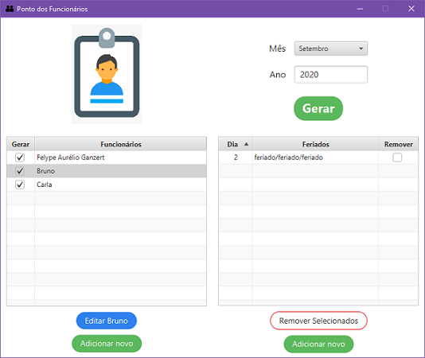
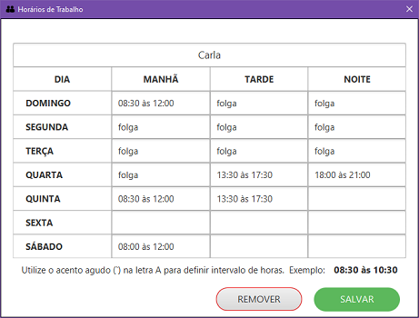
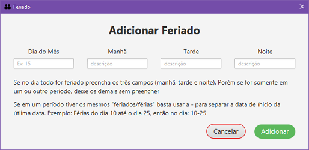

# Ponto de funcionários #
O objetivo do projeto é gerar a folha de ponto com os horários preenchidos em uma planilha do Excel. Foi usado também para praticar conceitos de ler/escrever arquivos, utilizar a biblioteca ApachePOI e utilizar conhecimentos em JavaFx.

- - - - 
## Visualizar ##
Para ter uma ídeia de como ficou a interface do projeto, você pode acessar:
https://youtu.be/9zBqfpgEfy4

## Começando ##
Para executar o projeto será necessário:
* [Java 8 ou superior para executar o projeto](https://www.oracle.com/java/technologies/javase-downloads.html)
  
Para editar o projeto são necessárias as bibliotecas:
* [JavaFx 11.0.2 ou superior](https://gluonhq.com/products/javafx/)
* [ApachePOI 4.1.2 ou superior](http://poi.apache.org/download.html)

**Dica**: No meu caso, eu criei uma User Library pras duas bibliotecas e então adicionei os .jar externos nela. Para fazer isso no Eclipse:

Window -> Preferences -> Java -> Build Path -> User Libraries -> e então criei uma com o nome "ApachePOI" e adicionei os jars externos e uma outra com o nome "JavaFX".

- - - -

## Simplesmente Executar ##
Se você está interessando somente em executar a aplicação, basta baixar o arquivo **ponto.jar** que está dentro da past **dist**.

- - - - 

## Funcionalidades ##

* É possível cadastrar/editar funcionários informando o nome e o cronograma semanal de horários.
* É possível inserir/editar feriados (ou dias em que os horários serão diferentes do habitual que estaria no cronograma do funcionário).
* As informações são salvas sempre no final da execução do programa em um arquivo **dados.txt** e esses dados são lidos sempre no ínicio do programa.
* A principal utilidade da aplicação está em gerar uma planilha do Excel (**Folha gerada.xlsx**) com  base no mês e ano informado com todos os dias do mês e os respectivos horários que o funcionário teria que ir trabalhar, tendo como base somente o cronograma e os feriados inseridos. Sendo que é gerado uma planilha para cada funcionário.

- - - -
 
 ## Telas ##

 

 
 
 

- - - - 

## Motivação ##
Desenvolvi esse projeto para atender uma demanda na minha empresa e para praticar ainda mais os assuntos: JavaFX, ApachePOI para lidar com planilhas do Excel; Leitura e gravação de arquivos; Conceitos de Orientação a Objetos, Conceitos de UI e UX.

Durante a elaboração do projeto, surgiram alguns problemas, então foi necessário buscar soluções únicas. Portanto caso você pense em outra forma de solucionar alguns pontos ficarei muito grato com a sua contribuição. Acabei esquecendo de comentar porque a utilização de determinadas estratégias no código, mas tentarei melhorar isso em projetos futuros.
